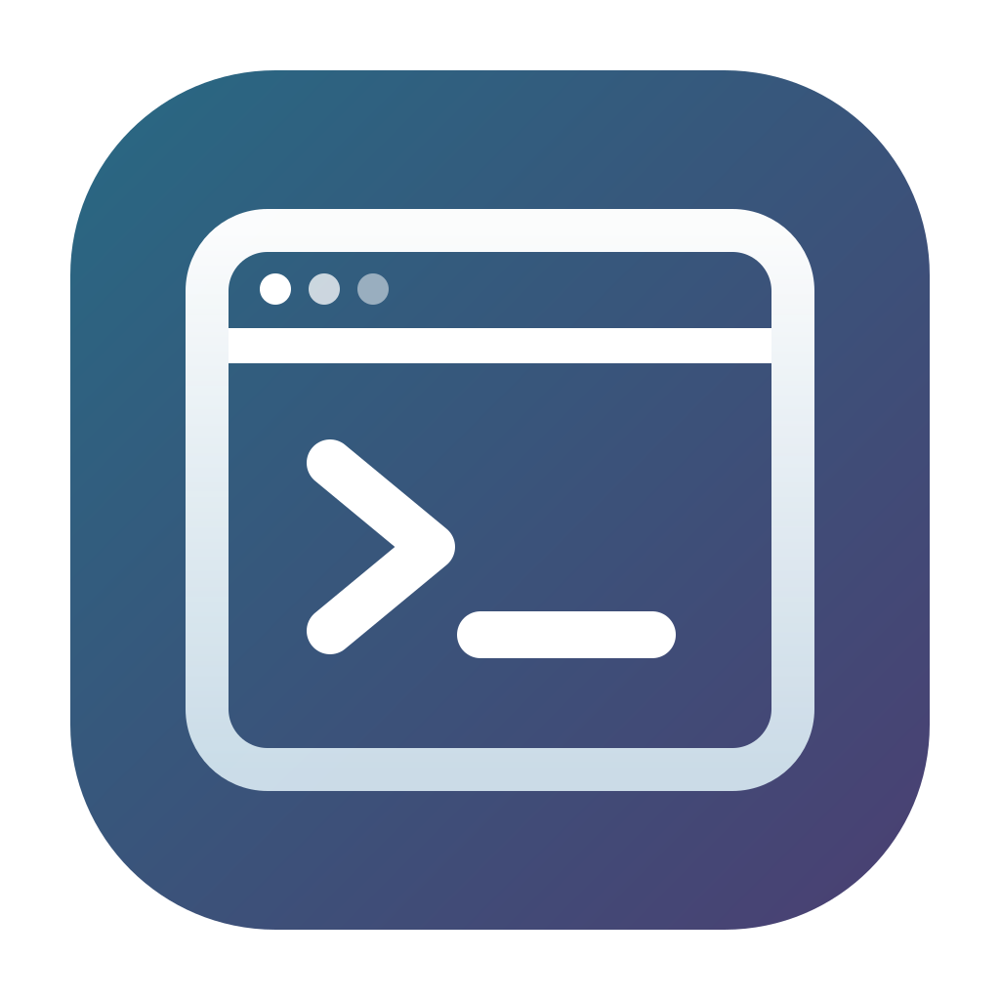

<p align="center">
  
</p>

<h1 align="center">WoW IDE</h1>

<p align="center">
  <a href="https://github.com/davafons/wow-ide/actions/workflows/ci.yml"></a>
  <a href="https://github.com/davafons/wow-ide/blob/main/LICENSE"></a>
</p>

**Keep the tools for the job beside the game.** WoW IDE is a Mac-first floating Chromium, Ghostty terminal, and Codex workspace for WoW Forever beta, regular WoW, and other desktop apps.

> [!IMPORTANT]
> WoW IDE is an early preview. The core workspace is usable, but compatibility, security hardening, signing, notarization, and release packaging are still in progress. It is not affiliated with or endorsed by Blizzard Entertainment.

## Features

- Floating browser, terminal, and Codex panels that can follow a selected application window
- A Chromium preview with tabs, responsive presets, local-development URLs, and docked DevTools
- Multiple embedded Ghostty terminal sessions with a configurable working directory
- A Codex app-server client with resumable threads, streaming output, interruption, and explicit approvals
- Saved panel layouts, independent minimize controls, global shortcuts, and optional launch at login
- Passive window behavior designed to avoid taking game input until a text surface is clicked

## Requirements

- macOS 14 Sonoma or later
- Swift 6 to build from source
- A local Codex CLI installation for the Codex panel
- Optional: AeroSpace for workspace-aware attachment to the selected app

The first build downloads Chromium Embedded Framework (about 116 MiB compressed) and checksum-pinned GhosttyKit (about 138 MB compressed).

## Build from source

On macOS 14 or later:

```sh
make package
open "dist/WoW IDE.app"
```

The packaging script assembles and ad-hoc signs `dist/WoW IDE.app`; it does not launch it. CEF needs the packaged framework and helper processes. Keep the bundle at a stable path if you enable the optional **Start at Login** menu item. Quit the old app before replacing a running package.

To build and refresh the Raycast-searchable development copy in `/Applications`, quit WoW IDE and run:

```sh
./scripts/install-development.sh
```

## Window and workspace behavior

Use the menu-bar icon's **Choose WoW App…** command to select the exact `.app` bundle. When that app has a window on a visible AeroSpace workspace, the requested browser, terminal, and Codex panels appear over it. The panels follow the selected window's position and resize while retaining their own draggable offsets. If the WoW workspace is hidden, the panels and their restore icons hide; they return when the workspace becomes visible. The largest target window is chosen initially, and the same window ID is retained while available. If AeroSpace cannot map a native fullscreen or unmanaged window, visibility falls back to whether CoreGraphics reports that target window on screen. When the selected WoW app is not running, the requested panels remain available at their last positions for standalone debugging; they attach again when WoW opens. With no target selected, panels remain manually placed and available.

The app uses separate browser, terminal, and Codex windows. Drag a custom header and resize from its bottom-right grip. Each **−** button minimizes only that panel to its own floating restore control. Click the control to restore its panel, or drag it to place it independently; its position is saved. The default global shortcuts are ⌘R for the browser, ⌘F for the terminal, and ⌘D for Codex; Settings offers an alternate shortcut set. If a panel was hidden with **×**, its shortcut shows the full panel first. The menu can also reopen hidden panels, and **Hide Panels** hides or restores all requested panels. The app remains in the menu bar until **Quit**. **Settings…** controls the shared appearance preset, terminal font and working directory, Codex working directory, target application, shortcuts, login startup, and layout reset.

Panels use a passive window mode: clicking buttons, headers, or other non-text content does not deliberately take keyboard input from WoW. A browser text field, terminal viewport, or Codex prompt may take keyboard focus after a direct click. Clicking another application releases browser and terminal focus without activating WoW. Clicking non-text panel content returns input to WoW when it was frontmost before text entry. Release held movement keys before moving focus; macOS may otherwise leave a key-down state in the game until the key is pressed again.

## Chromium browser

The browser starts on a built-in page. Enter a public HTTP(S) URL or a local app such as `localhost:5173`; bare public domains use HTTPS and localhost uses HTTP. Back, forward, and reload are beside the address field. Reload bypasses cache; development-server HMR uses its usual WebSocket connection. External HTTP(S) links open new tabs, up to eight.

**DevTools** splits the browser panel and loads Chromium's inspector frontend through an exact-origin local debugging endpoint. When two tabs have the same URL, the inspector declines to choose an ambiguous target. **Focus Tools** gives the inspector keyboard focus; clicking non-text browser content returns focus to WoW when eligible. The viewport menu provides Desktop, Responsive, Phone 390 × 844, and Tablet 768 × 1024. Phone and Tablet use Chromium device metrics and touch emulation; they do not change the user agent or emulate device hardware.

Chromium stores cookies, site data, and cache under `~/Library/Application Support/WoWIDEFeasibility/Chromium`, separate from Chrome and Brave. **Clear Chromium Data on Next Launch** deletes that profile before CEF initializes on the next start. This internal ad-hoc build uses CEF's mock keychain, so cookie encryption at rest is not meaningful; avoid sensitive accounts.

## Ghostty terminal

The terminal embeds Ghostty's engine through a locally patched Termini wrapper and opens `/bin/bash -l` in a local pseudo-terminal. Its font, default 14-point size, and Solarized Dark colors match the installed Ghostty profile observed during this build. The terminal's default background is transparent, so the viewport uses the same blurred HUD material as the browser frame while Ghostty keeps text, selections, and explicit terminal colors crisp. Use its session bar to add, select, restart, or close independent shells. New and restarted shells use the directory selected in Settings. Termini also loads Ghostty's default configuration files, but the profile is snapshotted in the panel source and does not live-sync with later Ghostty config changes. Shells continue while their panel is hidden or minimized.

## Codex

The Codex panel connects to the locally installed `codex app-server`, reuses the CLI's authentication and configuration, resumes the last thread, lists recent threads for the selected working directory, streams responses, and can interrupt an active turn. Command and file-change approvals remain visible in the panel and require an explicit **Approve** or **Deny** choice. Choose the working directory in Settings before starting a project-specific thread.

The GhosttyKit snapshot is an early, static binary dependency built from Ghostty plus Termini embedding patches; it is not the installed Ghostty application's UI or shared process. The vendored Termini patch removes its usual forced app activation so the terminal can obey the overlay's passive focus rule. See [third-party notices](THIRD_PARTY_NOTICES.md).

## Planning documents

- [Product requirements](docs/PRD.md)
- [Technical architecture](docs/ARCHITECTURE.md)
- [Research and compatibility notes](docs/RESEARCH.md)
- [Milestones and release plan](docs/ROADMAP.md)
- [Open-source and reuse policy](docs/OPEN_SOURCE.md)

## Development

```sh
make build    # debug build
make test     # lint scripts and compile the app
make icon     # regenerate AppIcon.icns from the checked-in SVG
make package  # assemble and ad-hoc sign the app bundle
```

The project currently has compile and packaging validation but no automated UI suite. Focus, fullscreen, window-following, and input behavior still require manual checks on the target macOS and game configuration. See the [roadmap](docs/ROADMAP.md) for the remaining release work.

## Privacy and security

Browser data stays in a dedicated CEF profile. Codex uses the locally installed CLI and its existing authentication. Terminal and Codex sessions execute with the current user's permissions. This preview is not sandboxed, and its ad-hoc Chromium build uses a mock keychain; do not use the embedded browser for sensitive accounts.

## License

WoW IDE is available under the [MIT License](LICENSE). Third-party components retain their own licenses; see [third-party notices](THIRD_PARTY_NOTICES.md).

“WoW IDE” is a working title. WoW is the first target profile, not a required integration.
