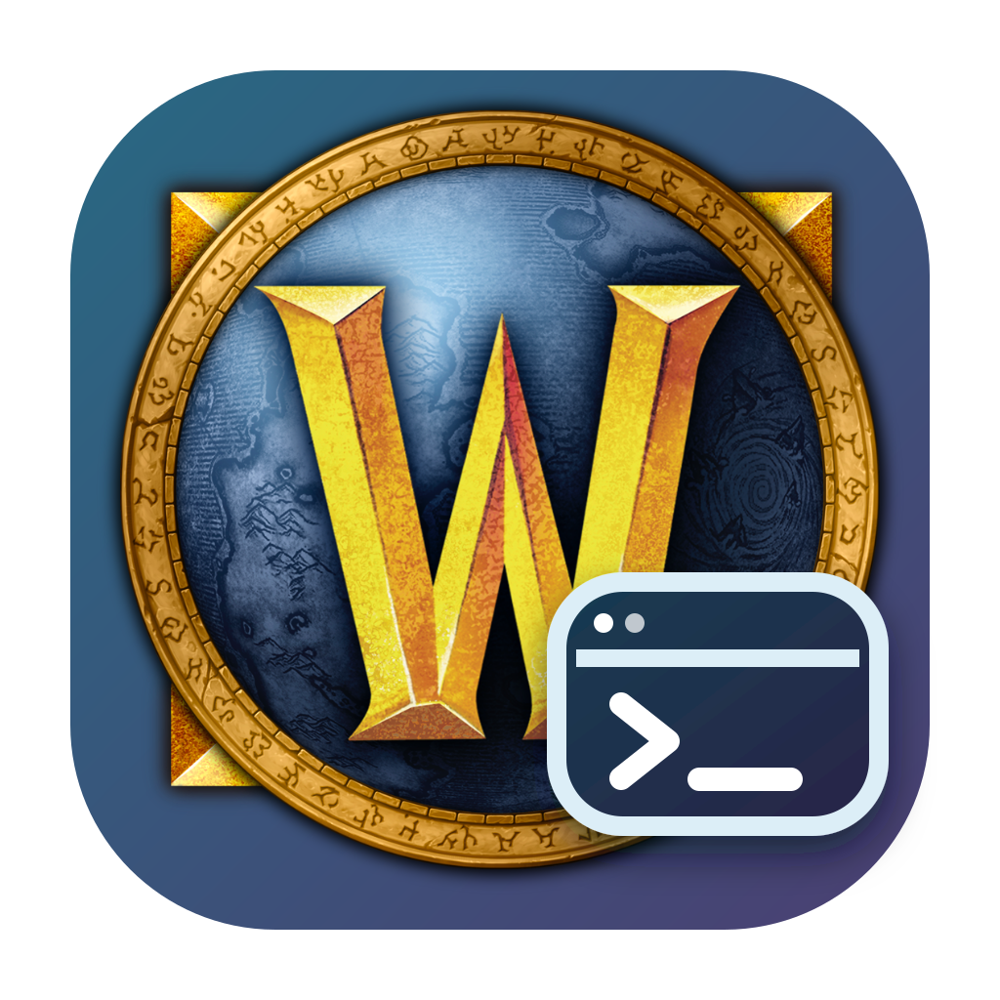
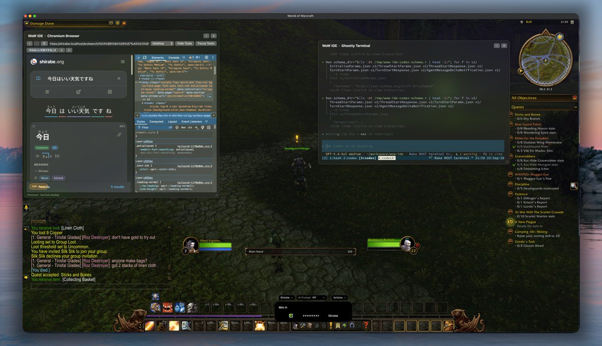

<p align="center">
  
</p>

<h1 align="center">WoW IDE</h1>

<p align="center">
  <a href="https://github.com/davafons/wow-ide/actions/workflows/ci.yml"></a>
  <a href="https://github.com/davafons/wow-ide/blob/main/LICENSE"></a>
</p>

**Keep the tools for the job beside the game.** WoW IDE floats a browser and terminal over World of Warcraft and other Mac apps, with an optional Codex panel for coding work.

| WoW IDE in game |
| --- |
|  |

> [!IMPORTANT]
> WoW IDE is an early macOS preview. It is not affiliated with or endorsed by Blizzard Entertainment.

## Build from source

Requires macOS 14 or later and Swift 6. Codex and AeroSpace integrations are optional.

```sh
make package
open "dist/WoW IDE.app"
```

The first build downloads the pinned Chromium Embedded Framework and GhosttyKit dependencies. To install a development build in `/Applications`, run `./scripts/install-development.sh`.

## Development

```sh
make build
make test
make icon
make package
```

## License

WoW IDE is available under the [MIT License](LICENSE). See [third-party notices](THIRD_PARTY_NOTICES.md) for bundled dependencies and artwork.

World of Warcraft and its icon are trademarks and artwork of Blizzard Entertainment. The icon artwork is used for identification and is not covered by this repository's MIT License.
